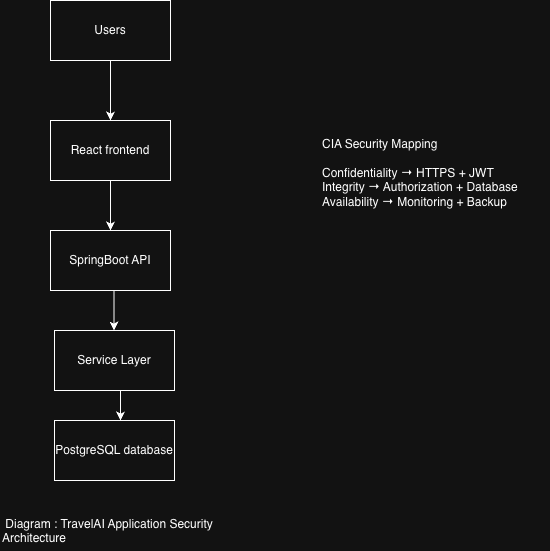

Module 02 – CIA Triad Assessment

## Engineering Security Design Review (ESDR)

**Application:** TravelAI  
**Review Type:** Security Design Assessment  
**Author:** Deepshikha Antony  
**Version:** 1.0  
**Status:** Completed

---

# 1. Purpose

The purpose of this document is to understand the CIA Triad and analyze how its three security principles — Confidentiality, Integrity, and Availability — apply to the TravelAI application.

This assessment identifies important application assets, evaluates potential security risks, and defines security considerations during software design.

---

# 2. Scope

This security review focuses on the following TravelAI modules:

- Login
- Registration
- AI Planner
- Travel RAG
- Saved Trips

The objective is to understand how security principles can be applied during application development.

---

# 3. Background

The CIA Triad is a fundamental security model used in cybersecurity to protect information and systems.

It consists of three principles:

1. Confidentiality
2. Integrity
3. Availability

---

# 4. Real-Life Perspective

Consider a banking application.

## Confidentiality

Customer account information should only be accessible to authorized users.

Example:

A customer should only view their own account details.

## Integrity

Customer information should remain accurate and should not be modified without authorization.

Example:

An attacker should not be able to change account balance information.

## Availability

Banking services should remain accessible whenever customers need them.

Example:

Customers should be able to access online banking services without interruption.

---

# 5. Technical Explanation

## Confidentiality

Confidentiality ensures that sensitive information is accessible only to authorized users.

Examples:

- User credentials
- JWT tokens
- User profiles
- Saved travel plans

Security controls:

- Authentication
- Authorization
- Encryption
- HTTPS

---

## Integrity

Integrity ensures that information remains accurate, complete, and protected from unauthorized modification.

Examples:

- Saved trips
- User information
- AI-generated travel plans

Security controls:

- Input validation
- Database constraints
- Access control
- Audit logging

---

## Availability

Availability ensures that applications and data remain accessible when required.

Examples:

- Login service
- AI Planner
- Travel RAG service
- Database

Security controls:

- Monitoring
- Backup
- Load balancing
- Error handling

---

# 6. TravelAI Architecture

Architecture security mapping:

| Component | Security Purpose |
|-----------|-----------------|
| HTTPS | Protects communication confidentiality |
| JWT | User authentication |
| Authorization | Protects user resources |
| Database | Maintains data integrity |
| Monitoring | Supports availability |

---

# 7. CIA Triad Mapping

| Component |  Confidentiality   |Integrity | Availability |
|---------------|----------------|-----------|------------------|
| Login         |High          | High           |Medium |
| Registration  |High          |  Medium        | Medium |
| AI Planner    | Medium       | High           | High |
| Travel RAG    | Medium       | High           | High |
| Saved Trips   | High         | High           | High |
| Database      | High         | High           | High |

---

# 8. Asset Identification

| Asset                 | Importance |
|-----------------------|------------|
| User Account          | Identifies application users |
| Password Hash         | Protects authentication credentials |
| JWT Token             | Provides authenticated access |
| User Profile          | Contains personal information |
| Saved Trips           | Stores user travel history |
| AI Planner Requests   | Contains user preferences |
| AI Planner Responses  | Contains generated itineraries |
| Travel Knowledge Base | Supports RAG responses |
| Database              | Stores application data |
| REST APIs             | Provides application functionality |

---

# 9. Security Risk Analysis

| Asset | Confidentiality Risk | Integrity Risk | Availability Risk |
|-|-|-|-|
| User Account | Account exposure | Unauthorized changes | Login unavailable |
| Password Hash | Password cracking attempts | Authentication failure | Login issues |
| JWT Token | Account impersonation | Token manipulation | Access failure |
| Saved Trips | Private data exposure | Unauthorized modification | Data unavailable |
| Database | Data leakage | Data corruption | Application outage |

---

# 10. Security Findings

## Finding 1: Sensitive Data Protection

TravelAI stores sensitive information including user profiles, authentication data, and travel plans. Appropriate security controls must be implemented.

## Finding 2: Authentication and Authorization

Authentication verifies user identity. Authorization ensures users can only access their own resources.

Example:

User A should never access User B's saved trips.

## Finding 3: Input Validation

All user-generated inputs should be validated before processing to reduce security risks.

## Finding 4: Secure Password Storage

Passwords should never be stored as plain text.

Secure hashing mechanisms such as BCrypt should be used.

## Finding 5: Error Handling

Application errors should not expose sensitive implementation details such as database errors or stack traces.

---

# 11. Recommendations

- Implement authentication for protected resources.
- Apply authorization checks before accessing user data.
- Validate all API inputs.
- Use HTTPS communication.
- Store passwords using secure hashing.
- Monitor application health.
- Perform regular security reviews.

---

# 12. Conclusion

The CIA Triad provides a structured method to evaluate application security.

By applying Confidentiality, Integrity, and Availability principles to TravelAI, developers can identify security risks early and design applications that protect user information while maintaining reliable service availability.

---

# 13. References

- OWASP Top 10
- NIST Cybersecurity Framework
- Spring Security Documentation
- PostgreSQL Security Documentation